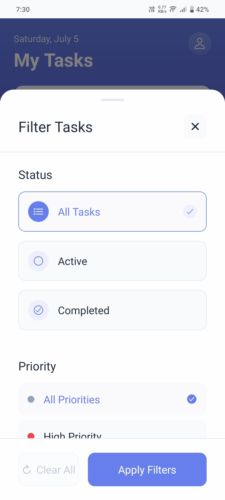

# 📋 Task Manager App

A simple and powerful Task Management App built with **React Native** and **Firebase**. Manage your daily tasks with ease — create, update, filter, and organize them based on priority and status.

---

## 🚀 Features

### 🔐 User Authentication

- ✅ Email/Password based Sign Up and Login using **Firebase Authentication**
- ❌ Displays error messages for invalid credentials (e.g., incorrect email/password)
- 🔓 Persistent login using Firebase session handling

### 📝 Task Management

- ➕ Add new tasks with:
  - Title
  - Description
  - Due Date (using Date Picker)
  - Priority (Low, Medium, High)
- ✏️ Edit existing tasks
- 🗑️ Delete tasks
- ✅ Mark tasks as Complete/Incomplete
- Stores Data in firebase and uses Zustand for state Management

### 🔍 Task Filtering

- Filter tasks by:
  - ✅ Priority: Low / Medium / High
  - ✅ Status: Completed / Incomplete
- Tasks sorted by **Due Date (earliest to latest)**

### 📆 Calendar Integration

- View tasks on a calendar-based view.

### 👤 Profile Page

- View/edit profile info
- Log out

---

## 🖼️ Screenshots

<table>
  <tr>
    <th>Login</th>
    <th>Signup</th>
    <th>Task List</th>
    <th>Filter Tasks</th>
  </tr>
  <tr>
    <td></td>
    <td></td>
    <td></td>
    <td></td>
  </tr>
</table>

<br/>

<table>
  <tr>
    <th>Add/Edit Task</th>
    <th>Calendar View</th>
    <th>Profile Page</th>
  </tr>
  <tr>
    <td></td>
    <td></td>
    <td></td>
  </tr>
</table>

---

## 🎥 Video Demo

[▶️ Watch Demo Video on Google Drive](https://drive.google.com/file/d/1z5M3TVBS-L8xOQCVjMagVBkvm66rp_1K/view?usp=sharing)

### ⚠️ Important Note

> ❗**APK Not Included**  
> The APK build was not included due to errors encountered during the build process.
>
> 🔒**Login Screen Freeze in Demo**  
> The video demo may appear stuck on the login screen. This is because **Android restricts screen recording during password entry** to protect user privacy. The app continues to work, but the recording is paused automatically during sensitive input.

---

This is an [Expo](https://expo.dev) project created with [`create-expo-app`](https://www.npmjs.com/package/create-expo-app).

## 🛠️ Get Started

1. Install dependencies

   ```bash
   npm install
   ```

2. Start the app

   ```bash
   npx expo start
   ```

In the output, you'll find options to open the app in a

- [development build](https://docs.expo.dev/develop/development-builds/introduction/)
- [Android emulator](https://docs.expo.dev/workflow/android-studio-emulator/)
- [iOS simulator](https://docs.expo.dev/workflow/ios-simulator/)
- [Expo Go](https://expo.dev/go), a limited sandbox for trying out app development with Expo

You can start developing by editing the files inside the **app** directory. This project uses [file-based routing](https://docs.expo.dev/router/introduction).
