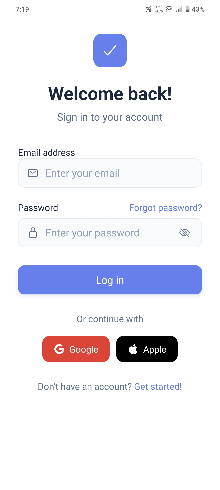
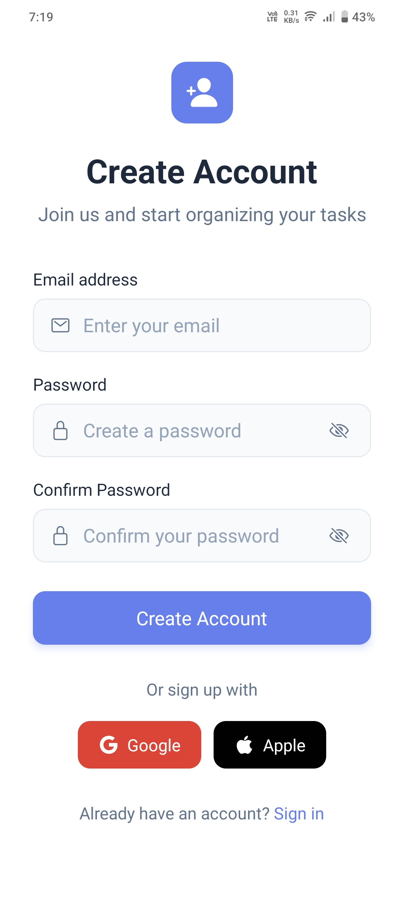
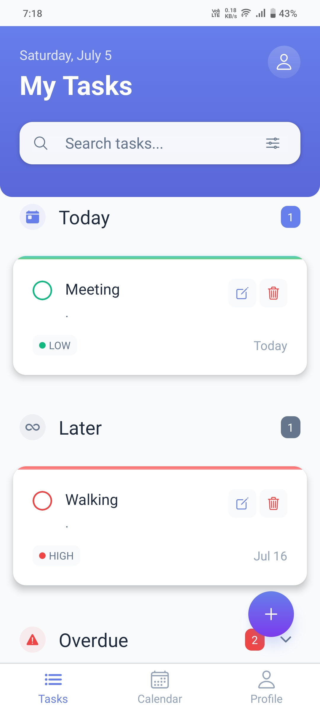
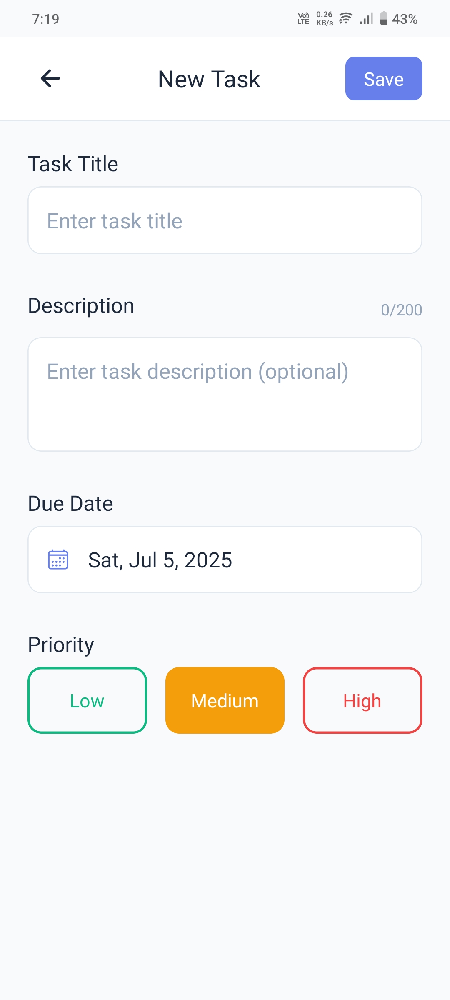
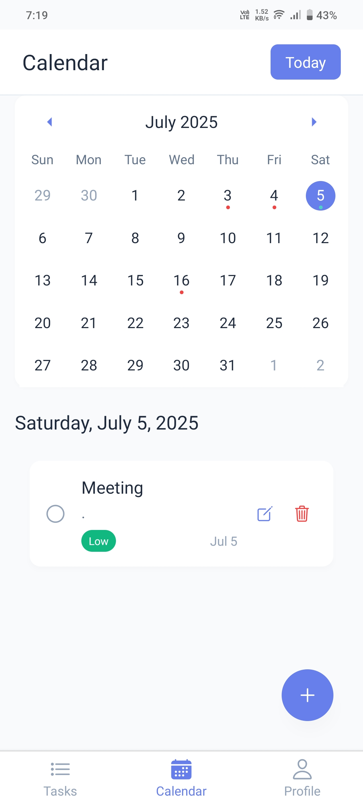

# 📋 Task Manager App

A simple and powerful Task Management App built with **React Native** and **Firebase**. Manage your daily tasks with ease — create, update, filter, and organize them based on priority and status.

---

## 🚀 Features

### 🔐 User Authentication

- ✅ Email/Password based Sign Up and Login using **Firebase Authentication**
- ❌ Displays error messages for invalid credentials (e.g., incorrect email/password)
- 🔓 Persistent login using Firebase session handling

### 📝 Task Management

- ➕ Add new tasks with:
  - Title
  - Description
  - Due Date (using Date Picker)
  - Priority (Low, Medium, High)
- ✏️ Edit existing tasks
- 🗑️ Delete tasks
- ✅ Mark tasks as Complete/Incomplete

### 🔍 Task Filtering

- Filter tasks by:
  - ✅ Priority: Low / Medium / High
  - ✅ Status: Completed / Incomplete
- Tasks sorted by **Due Date (earliest to latest)**

### 📆 Calendar Integration (Optional)

- View tasks on a calendar-based view (if implemented)

### 👤 Profile Page

- View/edit profile info
- Log out

---

## 🖼️ Screenshots

<table>
  <tr>
    <th>Login</th>
    <th>Signup</th>
    <th>Task List</th>
  </tr>
  <tr>
    <td></td>
    <td></td>
    <td></td>
  </tr>
</table>

<br/>

<table>
  <tr>
    <th>Add/Edit Task</th>
    <th>Calendar View</th>
    <th>Profile Page</th>
  </tr>
  <tr>
    <td></td>
    <td></td>
    <td></td>
  </tr>
</table>


---

## 📂 Project Structure

This is an [Expo](https://expo.dev) project created with [`create-expo-app`](https://www.npmjs.com/package/create-expo-app).

## Get started

1. Install dependencies

   ```bash
   npm install
   ```

2. Start the app

   ```bash
   npx expo start
   ```

In the output, you'll find options to open the app in a

- [development build](https://docs.expo.dev/develop/development-builds/introduction/)
- [Android emulator](https://docs.expo.dev/workflow/android-studio-emulator/)
- [iOS simulator](https://docs.expo.dev/workflow/ios-simulator/)
- [Expo Go](https://expo.dev/go), a limited sandbox for trying out app development with Expo

You can start developing by editing the files inside the **app** directory. This project uses [file-based routing](https://docs.expo.dev/router/introduction).

## Get a fresh project

When you're ready, run:

```bash
npm run reset-project
```

This command will move the starter code to the **app-example** directory and create a blank **app** directory where you can start developing.

## Learn more

To learn more about developing your project with Expo, look at the following resources:

- [Expo documentation](https://docs.expo.dev/): Learn fundamentals, or go into advanced topics with our [guides](https://docs.expo.dev/guides).
- [Learn Expo tutorial](https://docs.expo.dev/tutorial/introduction/): Follow a step-by-step tutorial where you'll create a project that runs on Android, iOS, and the web.

## Join the community

Join our community of developers creating universal apps.

- [Expo on GitHub](https://github.com/expo/expo): View our open source platform and contribute.
- [Discord community](https://chat.expo.dev): Chat with Expo users and ask questions.
